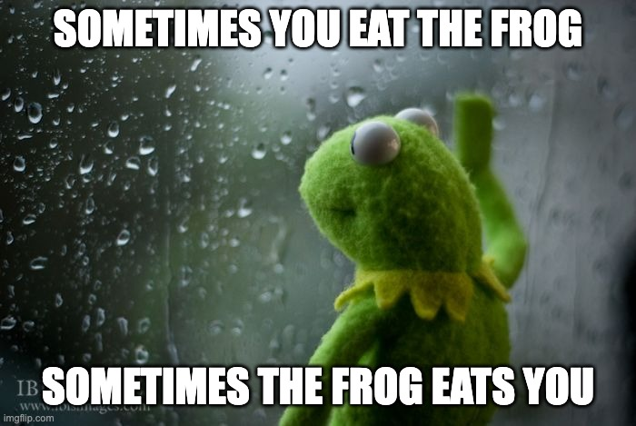

class: center, middle, title-slide


```{r setup, include=FALSE}
options(htmltools.dir.version = FALSE)

library(ggplot2)
library(tidyverse)
library(readr)
library(gridExtra)
library(cowplot)

#library(jtools)


knitr::opts_chunk$set(fig.retina = 3, 
                      warning = FALSE, 
                      message = FALSE)


theme_set(theme_minimal(base_size = 20)) # sets a default ggplot theme

#has_bash <- Sys.which('bash') != '' && .Platform$OS.type != 'windows'

library(RefManageR)
bib <- ReadBib("PracticeR_FINAL.bib", check = FALSE)
ui <- "- "
```


```{r best-features, echo=FALSE}
#search
#xaringanExtra::use_search(show_icon = TRUE, position = "top-right")

xaringanExtra::use_progress_bar(color = "#023047", location = "top")

# xaringanExtra::style_search(match_background = "black",
#                             input_background = "white",
#                             input_border = "black",
#                             match_current_background = "green")


xaringanExtra::use_panelset()
xaringanExtra::use_tile_view()
xaringanExtra::use_clipboard()

```


```{r xaringan-themer, include=FALSE, warning=FALSE}
library(xaringanthemer)
style_mono_accent(
  base_color = "black",
  header_font_google = google_font("Lato"),
  text_font_google   = google_font("Montserrat", "300", "300i"),
  code_font_google   = google_font("Fira Code")
)
```

```{r meta, echo=FALSE}
library(metathis)
meta() %>%
  meta_general(
    description = "A overview how to put R code into production.",
    generator = "xaringan and remark.js"
  ) %>% 
  meta_name("github-repo" = "edgar-treischl/Workshop_GitHubIntro") %>% 
  meta_social(
    title = "Make it reproducibleR: Put R in Production",
    url = "https://edgar-treischl.github.io/Workshop_reproducibleR/",
    og_type = "website",
    og_author = "Edgar J. Treischl"
  )
```


```{r, results='asis', echo=FALSE}
cat(readLines("github-corner.html"), sep = "\n")
```

# Code Quality and Style

### <a href="http://www.edgar-treischl.de" target="_blank">Dr. Edgar J. Treischl</a>

.white[Last update: `r Sys.Date()`]

.footnote.slide-footer[
  Press `r emoji::emoji("o")` or `r emoji::emoji("arrow_right")` to navigate
]


```{css, echo = F}
.reduced_opacity {
  opacity: 0.5;
}
```


---
## Agenda


### 01 Bad Habits
### 02 Clean Code
### 03 Modular Code
### 04 Maintain Code and Develop with Style


---

class: middle, center, inverse

## Let's face the truth, develop code but ...


---
background-image: url("images/beaker2.gif")
background-size: cover
class: bottom, center


# .white[Get rid of bad habits <br> `r emoji::emoji("smile")`] 

<div class="remark-footer"><a href="https://giphy.com/gifs/moodman-batman-smack-smacked-Qumf2QovTD4QxHPjy5" target="_blank" style="color: white;">Images source: MOODMAN</a></div>


---
## Wipe the Slate Clean: Restart R Like a Pro

- Ever had code that worked perfectly on your machine — but mysteriously breaks when someone else tries to run it?

- Old objects in your global environment linger like ghosts: 


```{r, eval=FALSE}
# Leftover objects
important_setting <- "production"

# Previously loaded function from packages
library(CoolCats)

# Changed global options
options(stringsAsFactors = TRUE)  # Please don't do this in 2025
```

Your code may unknowingly rely on these leftovers. It runs perfectly on your machine — but fails for anyone else who doesn’t share your local setup. 


---
## Wipe the Slate Clean: Restart R Like a Pro

.pull-left[

- `r emoji::emoji("repeat")` Make it a Habit: Restart your R session and run your code from scratch (Ctrl + Shift + F10)

- Don't save the workspace and don't load the workspace from an `.Rdata` file 

- It’s the only way to ensure your code runs in a fresh, clean R session 

 
### Abandon the rm approach `r emoji::emoji("shoot")`

- `rm(list = ls())` deletes user-created objects from the global workspace

- **But**: The code may break due to hidden dependencies: Attached packages are not detached, changed options are not restored, working directory is untouched!


]

.pull-right[
<figure>
    
</figure>
]


---
background-image: url(https://github.com/rstudio/hex-stickers/blob/main/PNG/knitr.png?raw=true)
background-position: 90% 5%
background-size: 8%

## R vs. Rmd

### `r emoji::emoji("finger")` Code lives in R, Code and Text in Rmd files

If you need to create a document from an `.R` file, run:

```{r, eval=FALSE}
# Spin converts an R script to an Rmd file
knitr::spin("script.R")
```

- Roxygen comments will be treated as text
- Add a `YAML` header to the script to control the output


If you need to extract the code from an `.Rmd` file, run:


```{r, eval=FALSE}
# Extracts R code chunks from Rmd files
knitr::purl()
```

- Adjust the level of extraction with the `documentation` parameter (e.g., code only)
- Set `purl = FALSE` to avoid the extraction of code chunks (see Xie 2024)


---
background-image: url("images/beaker1.gif")
background-size: cover
class: bottom, center

## .orange[Write clean code, dude! `r emoji::emoji("silly")`] 


---
## Write Clean Code

### Clean code prioritizes:

- Readability
- Simplicity
- Clarity

### Messy code often reveals itself: 

- Long, complicated functions that try to do too much
- Duplicated code scattered throughout scripts
- Inconsistent naming that leaves you guessing what’s going on
- Hardcoded values
- Absolute paths


---

## Don't Go Places Where You Don't Belong ...


---

## Abandon absolute paths, they will break anyway


```{r, eval=TRUE, error=TRUE}
# Don't:
readr::read_csv("~/Documents/reports/data/104_data.csv")
```

### `r emoji::emoji("lightning")` Create a project and use the `here` package:

```{r}
# Here returns the path to the project
here::here()
```


```{r, eval=TRUE}
# Create a path to the file is a piece of cake
here::here("data", "muppets_income.csv")
```


---

## Avoid Hardcoding Values or I’ll Burn Your Code

- The pain begins if you forget to integrate hard coded values as function parameters:


```{r, eval=TRUE}
library(dplyr)
filtered_data <- mtcars |> 
  filter(mpg > 25)
```

### `r emoji::emoji("frog")` This makes your code a mess to maintain

- What if you need to filter a different value? You’d have to search through your code to find every instance of the hard coded value and change it — and you probably forget half of them.


- Another one? Rounding hell in a large report:


```{r, eval=FALSE}
# Hardcoded rounding is not bad, true?
mtcars |> mutate(mpg_rounded = round(mpg, 2))
```


---

## Avoid Hardcoding Values II


### Set parameters at the top of your file while developing ...

```{r}
round_digits <- 2
mpg_threshold <- 25

mtcars |>
  filter(mpg > mpg_threshold) |>
  mutate(mpg_rounded = round(mpg, round_digits))
```


- Once you start wrapping code into functions, pass values as arguments — even if you don’t plan to change them right now. You’re future-proofing your code.


---

## Avoid Hardcoding Values III

### Move it into a function (with a default):

```{r}
filter_and_round <- function(data, mpg_limit, digits = 2) {
  data |>
    dplyr::filter(mpg > mpg_limit) |>
    dplyr::mutate(mpg_rounded = round(mpg, digits))
}

# Use the default
filter_and_round(mtcars, mpg_limit = 25)
```


#### `r emoji::emoji("point_right")` This approach makes your code flexible, readable, and much easier to maintain

---
background-image: url("images/cookimonster.gif")
background-size: cover
class: bottom, center

## .white[Break ’em into nice bites `r emoji::emoji("silly")`] 


---
## Modular Code

### `r emoji::emoji("point_right")` Each function should do one thing — and do it well

- Modularity means breaking your code into smaller, self-contained pieces — typically functions, where each one handles one specific task
- Instead of writing one long script that tries to do everything, modular code splits the work into clear, manageable chunks


### `r emoji::emoji("point_right")` Modular code makes your code easier to read, test, and develop

- Each piece can be understood and worked on independently
- Reusable functions save time and reduce duplication
- Testing is simpler because you can write small, focused tests instead of validating everything at once
- Changes easier to apply, since you only need to update one part of the codebase


---
## Don’t Dump Everything in One Function

.pull-left[

- It’s tempting to just get everything working in a single function or a long script — a pipeline that loads the data, cleans it, analyzes it, calls your mum, and spits out the result.

- As soon as you need to tweak something, explain it to someone else, or reuse part of it, things get messy. 

Suddenly, you’re stuck picking apart a script that’s hard to read, hard to change, and the code may break.

]

.pull-right[

```{r, eval=FALSE}
# Load data
df <- read.csv("data.csv")

# Data cleaning
df <- df |> 
  filter(!is.na(price)) |> 
  mutate(price_log = log(price)) |> 
  do_furher_fancy_things

# Analysis
model <- lm(price_log ~ bedrooms + sqft, data = df)

# Plotting
plot(df$sqft, df$price_log)
```


]

### `r emoji::emoji("kiss")` Keep it simple, stupid! Don't violate the KISS principle


---

## Don’t Dump Everything in One Function

- At first glance, it might seem fine — but now imagine you want to reuse the cleaning logic in a different script. Or test how the model works on another dataset. Or change the plotting code without rerunning the model. 


### `r emoji::emoji("frog")` You’re stuck. Everything depends on everything else.


### `r emoji::emoji("point_right")` Modularize Code: Break your code into logical, reusable pieces

- Break your logic into small, focused functions that each do one thing. 

- That’s called *separation of concerns*. Separate *at least* logically:
  - Insert code that belong to data preparation, analysis, and reporting into *separate functions*
  - Organize your codebase, create separate R scripts (e.g., analyze.R, plot.R) that follow your internal logic 
  - Define functions for each logical, reusable step


---

## Don’t Dump Everything in One Function

### `r emoji::emoji("cookie")` Break ’em into nice bites ...

```r
# source.R
load_data <- function(path) {
  read.csv(path)
}

clean_data <- function(df) {
  df |> filter(!is.na(price)) |> mutate(price_log = log(price))
  ...
}

#> And so on ...
```


### `r emoji::emoji("lightning")` This approach is not a clean separation of concerns if your function does more than one thing, but it’s a start!


---

## Don’t Dump Everything in One Function

### `r emoji::emoji("cookie")` Save and source it ...

```{r, eval=FALSE}
# Source the functions
source("source.R")

# Main script
df <- load_data("data.csv")
df_clean <- clean_data(df)
model <- fit_model(df_clean)
plot_relationship(df_clean)
```


<div class="info-box">
  <i>`r emoji::emoji("light_bulb")`</i> This version is better because it's modular, readable, and flexible. Want to swap in a new dataset? Easy. Want to test the clean_data function? Just do it, you are on fire!
</div>


---

## Don’t Dump Everything in One Function


### The code need to run in sequence? Wrap it in a function

```{r, eval=FALSE}
# Wrap the workflow in a function
run_job <- function(data_path) {
  df <- load_data(data_path)
  df_clean <- clean_data(df)
  model <- fit_model(df_clean)
  send_mail(result = model)
  result <- plot_relationship(df_clean)
  
  return(result)
}
```

- This make the workflow explicit: It helps others understand how your code fits together

- Only after we break our code into logical, reusable pieces, we can really get to understand how to refactor it. Of course, it is extra work, but it’s part of the development process.

#### Finally, you can build an R package for our source code `r emoji::emoji("kiss")`


---
## Don’t Repeat Yourself (DRY)


### `r emoji::emoji("point_right")` Wrap It in a Function

.pull-left[

<div class="info-box">
  <i>`r emoji::emoji("light_bulb")`</i> Repeating the same code multiple times increases the risk of errors, bloats scripts, and makes maintenance harder. The DRY principle encourages you to write logic once and reuse it via functions. This makes your code cleaner, easier to test, and more maintainable.
</div>


]

.pull-right[

```{r}
# Some repetitive code ...
library(dplyr)
library(gapminder)

# Filter for Germany in 2007
germany_2007 <- gapminder |>
  filter(country == "Germany", year == 2007) |>
  select(country, year, lifeExp, gdpPercap)

# Filter for Japan in 2007
japan_2007 <- gapminder |>
  filter(country == "Japan", year == 2007) |>
  select(country, year, lifeExp, gdpPercap)

# Filter for France in 2007
# And so on ...
```


]


---
## Don’t Repeat Yourself II

Turn repeated code into parameterized functions to save time and avoid bugs

```{r}
slice_gapminder <- function(data, country, year) {
  data |>
    dplyr::filter(country == !!country, year == !!year) |>
    dplyr::select(country, year, lifeExp, gdpPercap)
}
```

### `r emoji::emoji("point_right")` Clean and reusable:

```{r}
japan_2007 <- slice_gapminder(gapminder, "Japan", 2007)
japan_2007
```


---
## Don’t Repeat Yourself III

Creating a function does not imply that we are ready yet. There is another very common blind spot:

```{r, eval=FALSE}
# Coding is hard work
japan_2002 <- slice_gapminder(gapminder, "Japan", 2002)
germany_2002 <- slice_gapminder(gapminder, "Germany", 2002)
france_2002 <- slice_gapminder(gapminder, "France", 2002)
```

Functions itself do not solve the problem of repetition if we call them repeatedly with only slight variations. 

### `r emoji::emoji("point_right")` Base R and purrr help to avoid repetition


---
## Base R against DRY

```{r}
# Define inputs
countries <- c("Japan", "Germany", "France")
years <- rep(2002, length(countries))

# Apply the function to both vectors using mapply()
results_list <- mapply(function(country, year) {
  slice_gapminder(gapminder, country, year)
}, countries, years, SIMPLIFY = FALSE)

# Combine the list of data frames into one
results <- do.call(rbind, results_list)
results
```


---
## Hello Purrr

.pull-left[

<div class="info-box">
  <i>`r emoji::emoji("parrot")`</i> The purrr package helps you avoid such repetitive code (Wickham and Henry 2025). The package is part of the tidyverse and provides a consistent, readable way to perform iteration in R. Instead of writing loops or repeating function calls manually, purrr lets you apply functions over lists, vectors, or data frames using a family of tools like *map*, *map2*, and *pmap*.
</div>


]

.pull-right[
<figure>
    <a href="https://purrr.tidyverse.org" target="_blank">
    </a>
</figure>
]


---
background-image: url(https://purrr.tidyverse.org/logo.png)
background-position: 90% 5%
background-size: 8%

## Purrr against DRY


```{r}
# Use purrr to iterate over countries and years
library(purrr)

# Extract the data for multiple countries and a specific year
countries <- c("Japan", "Germany", "France")
years <- rep(2002, length(countries))

# Map2 to apply the function across both vectors
results <- map2(countries, years, ~ slice_gapminder(gapminder, .x, .y))

# Map2 returns a list, so we can bind the results
results |> dplyr::bind_rows()
```


---
background-image: url(https://purrr.tidyverse.org/logo.png)
background-position: 90% 5%
background-size: 8%

## Purrr against DRY

- As outlined, you don’t need purrr to avoid repetition – you can achieve similar results using base R functions like `sapply()` and other *apply* variants. 

- This can be useful if you want to reduce dependencies or keep your code lightweight.

- However, purrr offers a more consistent and readable syntax, especially when working within the tidyverse ecosystem. Its functions are designed to work seamlessly with tibbles and dplyr verbs, making it easier to integrate into data analysis workflows.

- Purrr has further goodies like:
  - Progress bars
  - Parallel computing
  
### `r emoji::emoji("point_right")` Purrr your way and DRY!


---
background-image: url("images/beaker3.gif")
background-size: cover
class: bottom, center

# .white[Robust Code don't bite ... `r emoji::emoji("silly")`] 


---
## Robust Code

A robust function behaves consistently: given the same input, it always returns the same output. This reliability starts with clearly defined inputs and outputs. 

### `r emoji::emoji("point_right")` A function should receive all it needs through its arguments — and return its results explicitly

- It should *not rely* on *global variables* or *hidden dependencies*

-  When each function is a *self-contained unit*, it’s easier to reuse and combine across your analysis or pipeline

- Next:

  - How to handle errors gracefully
  - How to avoid unintended side effects (like accidental data exports)
  - How to manage credentials securely


---
background-image: url(https://rlang.r-lib.org/logo.png)
background-position: 90% 5%
background-size: 8%

## Handle Errors Gracefully

.pull-left[

Write code that anticipates problems and handles them in a way that doesn’t crash your script or leave the user guessing (defensive programming)

- **Validating inputs**: check that function arguments meet expected criteria (e.g., correct type, range, format) before proceeding.

- **Catching errors**: use tryCatch() to manage potential errors during execution.

- **Helpful feedback**: when something goes wrong, provide clear, actionable error messages that guide the user on how to fix the issue.


]

.pull-right[

#### Check required input: `rlang::check_required(name)`

```{r, error=TRUE}
# This function requires a name argument
say_hello <- function(name) {
  rlang::check_required(name)
  
  # Do a lot of steps before we greet
  # Let user wait ;)
  
  return(paste("Hello", name, "!"))
}

say_hello()
```

]


---
background-image: url(https://rlang.r-lib.org/logo.png)
background-position: 90% 5%
background-size: 8%

## Handle Errors Gracefully II


.pull-left[

The `cli` package provides functions to create consistent and informative messages, warnings, and errors in R.

- Inform the user:

```{r, error=TRUE, message=TRUE, warining = TRUE}
cli::cli_alert_info("I am an info!")
```

- Success message:

```{r, error=TRUE, message=TRUE, warining = TRUE}
cli::cli_alert_success("I am gold.")
```


]

.pull-right[

#### Abort if input is not a character: `rlang::is_character(name)`


```{r, error=TRUE, message=TRUE, warining = TRUE}
# Validate input with rlang
say_hello <- function(name) {
  abort_message <- "`name` must be a string."
  
  if (!rlang::is_character(name)) {
  cli::cli_abort(abort_message)
    }
  
  return(paste("Hello", name, "!"))
}

say_hello(1)
```

]


---
background-image: url(https://rlang.r-lib.org/logo.png)
background-position: 90% 5%
background-size: 8%

## Handle Errors Gracefully III


.pull-left[

- We can limit the input to a specific set of options, like a list of valid names or categories with the arg_match() function

- Sometimes one tiny little letter is enough to make an mistake, but rlang has our back.

```{r, error=TRUE, message=TRUE, warining = TRUE}
# Restrict input to specific options
say_hello <- function(name = c("Tom", "Jerry")) {
  
  rlang::arg_match(name)
  return(paste("Hello", name, "!"))
}
```


]

.pull-right[

```{r, error=TRUE, message=TRUE, warining = TRUE}
say_hello(name = "Edgar")
```


```{r, error=TRUE, message=TRUE, warining = TRUE}
# Help users with typos
say_hello(name = "Pom")
```

]


<br>
Sometimes, you need to handle errors that occur during execution, especially when dealing with external resources like files, databases, or APIs. This is where `tryCatch()` comes in.


---


## tryCatch()

.pull-left[

The function allows us to intercept and respond to errors, warnings, and other conditions without crashing the users interface. The tryCatch() function has several components:

- `expr`: the code that is supposed to run
- `error`: what to do if an error happens
- `warning`: what to do if a warning happens
- `finally`: code that always runs, no matter what


]

.pull-right[


```{r, error=TRUE, message=TRUE, warining = TRUE}
result <- tryCatch({
  warning("Something might be wrong")
  x <- 10 / "a"
  x
}, warning = function(w) {
  message("Warning: ", w$message)
  0
}, error = function(e) {
  message("Error: ", e$message)
  NA
})

print(result)

```


```{r, echo=FALSE, eval=FALSE}
# The first line inside tryCatch triggers a warning => The last example returns 0, not NA => Both: withCallingHandlers
result <- tryCatch({
  withCallingHandlers({
    warning("Something might be wrong")
    x <- 10 / "a"
    x
  }, warning = function(w) {
    message("Warning: ", w$message)
  })
}, error = function(e) {
  message("Error: ", e$message)
  NA
})


```


]


---
## tryCatch II


.pull-left[


Here’s a breakdown of how it works in a real world example:

- Warning handler: If a warning occurs during readRDS(), it will be caught and displayed using cli::cli_warn(). The warning is then muffled to prevent further output.

- Error handler: If an error occurs, a custom error message is shown with cli::cli_alert_danger(), and NULL is returned as a fallback.
- Finally: The code that runs no matter what. It’s useful for logging, cleanup, or confirming that the operation finished.


]

.pull-right[

```{r, error=TRUE, message=TRUE, warining = TRUE}
# Attempt to read a file
result <- tryCatch(
  {
    readRDS("not_a_real_file.rds")
  },
  warning = function(w) {
    cli::cli_warn("Warning: {conditionMessage(w)}")
    invokeRestart("muffleWarning") #suppress further warning
  },
  error = function(e) {
    cli::cli_alert_danger("Error: {conditionMessage(e)}")
    NULL  # return fallback value
  },
  finally = {
    cli::cli_alert_info("Finished.")
  }
)
```


]


---
## try()

- Use `try()` if you don’t need detailed error handling logic but still want graceful failure: 

.pull-left[

- It catches errors and continues running. The function runs the given expression, but if an error happens, it catches that error as an object instead of stopping the function.

- Using the `silent` option keeps the default error message from showing, so you can handle the problem silently.

- As a second step, the code checks if an error occurred with `inherits(result, "try-error")`. Inherits checks if the result is of class try-error, which indicates that an error was caught. In case of an error, we can handle it gracefully.


]

.pull-right[

```{r, error=TRUE, message=TRUE, warining = TRUE}
# Please don't stop ... on error
result <- try(readRDS("file.rds"), 
              silent = TRUE)

# Check if it worked
if (inherits(result, "try-error")) {
  cli::cli_abort(
    "The file could not be found."
    )
}else {
  cli::cli_alert_success(
    "File read successfully!"
    )
  # Continue processing ...
}
```


]


---

## Declare Side Effects

.pull-left[

- Don’t just insert code that exports data: This is not a good practice, actually it’s rude.

- The next example is really a bad practice because such a code snippet will overwrite the file if it already exists:

```{r, eval=FALSE}
# Using an export step somewhere 
# in the code is not a good practice
fwrite(tmp.orig.from,
  "../data.csv",
  sep = ";",
  dec = ","
)
```


]

.pull-right[

- Create a function that takes into consideration whether to export the data or not!

```{r, eval=FALSE}
# Make the export explicit and conditional
myfun <- function(export = FALSE) {
  data <- "Hello World"
  
  if (export) {
    fwrite(tmp.orig.from, 
           "../data.csv",
           sep = ";",
           dec = ",")
  }else {
    return(data)
  }
}
```


]


---

## Declare Side Effects II

.pull-left[

- Ask for Permission:

```{r, eval=FALSE}
usethis::ui_yeah("Shall I export the data?")

#> Shall I export the data?
#> 
#> 1: Negative
#> 2: Absolutely not
#> 3: Definitely
#> 
#> Selection: 3
#> [1] TRUE
```


]

.pull-right[

- By asking about permission, the user is in control of their environment:

```{r, eval=FALSE}
# Ask for permission before exporting
myfun <- function(export = FALSE) {
  
  # Shall we export?
  yeah_export <- usethis::ui_yeah("Shall I export the data?")

  if (yeah_export) {
    export_data()
  }
}
```

]


---

## Declare Side Effects III

### `r emoji::emoji("point_right")` Files should be exported in the working directory 


If the file needs to be exported to a different location, insert the path in the function call. This way, the path is not hard codeded and can be adjusted. 

```{r, eval=FALSE}
# Respect the user, export only when asked, and allow to set the path
myfun <- function(export = FALSE, export_dir = "data") {
  
  if (export) {
    export_path <- fs::path(export_dir, "data.csv")
    data.table::fwrite(data, export_path)
    cli::cli_alert_success("Exported data to {export_path}")
  } else {
    return(data)
  }
}
```

### `r emoji::emoji("point_right")` Export only when asked and inform the user!


---
## Manage Secrets Like a Grown-Up

- Hardcoding API keys, tokens, or environment-specific settings into the code might seem harmless — until the keys show up in the history, your teammates copy over your local paths, or an app fails because it’s pointing to your local environment

- In case of GitLab, a secret in the code is visible to anyone with access — forever — even if you delete it later

### For Machine-Level Secrets: .Renviron

.pull-left[


- The usethis package provides a handy function to open and edit your `.Renviron` file — a config file that’s automatically loaded every time R starts

- It’s a great place to store personal, local secrets, or paths that shouldn’t be shared


]

.pull-right[


```{r, eval=FALSE}
# Open your .Renviron file
usethis::edit_r_environ()

# Add a Key
API_KEY=sk_abc123

# Access it in your code
API_KEY <- Sys.getenv("API_KEY")
```

]


---
## Manage Secrets Like a Grown-Up II

The `.Renviron` approach works well for local development, but once it’s time to share the code, it’s time to level up your config game.


### For Project-Specific Secrets: dotenv 


.pull-left[


- The `dotenv` package lets you keep environment variables in a project-specific `.env` file.

- This approach is perfect when settings vary by project, or when you’re working in a team where everyone has different credentials, file paths, or environments

An example .env file looks like this:

```bash
OPENAI_API_KEY=sk_project_specific_key
```


]

.pull-right[

- You can access these secrets after running the `load_dot_env()` function.

- The function reads the `.env` file and sets the variables as environment variables for your session:


```{r, eval=FALSE}
# Load and access the secret
dotenv::load_dot_env()
key <- Sys.getenv("API_KEY")
```

]


---
## Hello config

It’s a hassle to juggle different setups — secrets, file paths, and other settings — depending on whether you’re developing locally, testing, staging, or deploying to production. 

.pull-left[

- The `config` package lets you define multiple named environments (like default, dev, etc.) in a clean YAML file

- The code just loads the correct configuration automatically, based on the current environment. All settings will be pulled from the appropriate section of the YAML file — no need to manually double-check; no need to rewrite part of your code


]

.pull-right[

<figure>
  <a href="https://rstudio.github.io/config/index.html" target="_blank">
    
  </a>
</figure>

]


<br>

<div class="info-box">
  <i>`r emoji::emoji("light_bulb")`</i> Just switch the environment variable like you switch a light switch, and your code will adapt automatically.
</div>


---
## Manage Secrets Like a Grown-Up III


### For Multi-Environment Settings: config 


.pull-left[


An example `config.yml` file:

```YAML
default:
  db_address: "101.166.44.311"
  data_dir: "data/test"
  enable_cache: false

test:
...

production:
  db_address: "101.166.44.313"
  data_dir: "/results"
  enable_cache: true
```


]

.pull-right[

After you added the config file, call the config package. It uses the default section from the `config.yml` file:


```{r, eval=FALSE}
config::get("db_address")
#> "101.166.44.311"
```

To switch environments, set the `R_CONFIG_ACTIVE` environment variable accordingly:

```{r, eval=FALSE}
Sys.setenv(R_CONFIG_ACTIVE = "production")
config::get("db_address")
#> "101.166.44.312"
```


]


---
## One Last Word of Caution

### `r emoji::emoji("point_right")` Don’t Commit These Files. Seriously.


.pull-left[

- Once a key is added to a Git repository, it’s written into the project’s history — and even if you delete the line later, the damage is done

- Make sure sensitive files are ignored and exclude them before you start to add your keys or crendetials

- Consider the appropriate ignore file and add the config.yml or .env file to it:
  - .gitignore — for the Git setup
  - .dockerignore — for Docker
  - .Rbuildignore — for R packages

]

.pull-right[

<figure>
    
</figure>

]

---
background-image: url("images/gonzo.gif")
background-size: cover
class: bottom, center

# .white[Maintain Code and Develop with Style `r emoji::emoji("silly")`] 


---
## Maintain Code

- *Version control* is the foundational practice for long-term maintainability (Branches, History, etc.)

- *Code reviews* of new features or bugs help catch issues early, share knowledge across the team, and ensure that new code adheres to our standards

- *Collaborative maintenance*—through comments, suggestions, or pair programming—helps ensure that the entire team feels ownership of the code and keeps it healthy for the long run

- Code maintenance is an *ongoing process*:
  - It’s not just about writing code that works today, but about ensuring it continues to work well as requirements evolve, dependencies change, and new team members join
  - Regularly revisiting and refactoring code, updating dependencies, and improving tests are all part of keeping your codebase in good shape


---
## Take Your Time, Time to Refactor


<div class="info-box">
  <i>`r emoji::emoji("thought_balloon")`</i> “Refactoring is a process of changing a software system in such a way that it does not alter the external behavior of the code yet improves its internal structure.” (Martin Fowler, Refactoring: Improving the Design of Existing Code)
</div>


As your project grows, code that was once “good enough” can become fragile, repetitive, or hard to read even for yourself if you have enough distance from the project. 

Refactoring gives you the opportunity to:

- Remove duplication (apply DRY more effectively)
- Improve modularity
- Enhance readability and clarity (clearer intent, better naming,
consistent style)
- Make testing and debugging easier (well-structured code is easier to isolate and test)
- Reduce technical debt (costs of choosing a quick or easy solution)


---
## The Tidyverse Style Guide

#### `r emoji::emoji("point_right")`  We stick to the tidyverse style guide because it provides a widely accepted, well-documented, and actively maintained standard that aligns with modern R development practices. 

.pull-left[

- A clear, consistent style makes it easier to spot bugs, understand logic at a glance, and collaborate across a team

- The tidyverse style guide provides a clear, opinionated set of conventions for writing clean, consistent R code—covering everything from naming variables to how you should format pipes and function arguments


]


.pull-right[

<div class="info-box">
  <i>`r emoji::emoji("light_bulb")`</i> By adopting this guide, we avoid the overhead of defining and maintaining our own custom rules; and we ensure that our code is immediately familiar to anyone experienced with the broader R community.


</div>


]


---
## The Tidyverse Style Guide II


.pull-left[

-   *Use `snake_case` for all object and function names*: Use `get_user_data()`, not `GetUserData()`
-   *Avoid abbreviations unless they are widely recognized*: Use `user_id`, not `u_id`
-   *Use ALL_CAPS for constants and environment variables*: Use `API_KEY`, not `api_key`
-   *Use descriptive, meaningful names*: Use `download_report()`, not `dl_rp()`
-   *Function names should sound like actions (verbs)*: Use `fetch_ls_data()`, not `ls_data`
-   *Variable names should sound like things (nouns)*: Use `user_list`, not `calculated_users`
-   *Use consistent naming for related objects*: Use `create_data()` and `create_script()`
-   *Name `.R` files to match their contents*: `read_data.R` contains `read_data()`


]


.pull-right[

[](https://allisonhorst.com/everything-else)  
*Artwork: Allison Horst*


]


---
background-image: url(https://github.com/r-lib/lintr/blob/main/man/figures/logo.png?raw=true)
background-position: 90% 5%
background-size: 8%


## Hello Lintr

The lintr package automatically flags deviations from your style guide.

.pull-left[

<div class="info-box">
  <i>`r emoji::emoji("parrot")`️</i>"lintr provides static code analysis for R. It checks for adherence to a given style, identifying syntax errors and possible semantic issues, then reports them to you so you can take action" (Hester et al. 2024).
</div>


]

.pull-right[

```{r}
lintr::lint(text = 'myFunction <- function(x, y) {
  if (sum(x, y) == 10) {
    print("Sum is correct!")
  }
}')
```

]


R Package goodie `r emoji::emoji("bad")`:

```{r, eval=FALSE}
#lintr::lint_dir(path = "R")
lintr::lint_package()
```


---
background-image: url(https://styler.r-lib.org/reference/figures/logo.png)
background-position: 90% 5%
background-size: 8%

## Hello Styler

The styler package reformats code to match a defined coding style with a single command.


.pull-left[

<div class="info-box">
  <i>`r emoji::emoji("parrot")`️️</i> "styler formats your code according to the tidyverse style guide (https://style.tidyverse.org) so you can direct your attention to the content of your code" (Müller and Walthert 2024).
</div>


]

.pull-right[

```{r}
styler::style_text(
  "myFunction<-function( x,y){
  if(sum( x , y )==10){
    print( 'Sum is correct!' )
  }
}"
)

```

]

R Package goodie `r emoji::emoji("bad")`:

```{r, eval=FALSE}
styler::style_pkg()
```


---
class: right, middle


## Thank you for your attention!


[`r icons::fontawesome("rocket")` www.edgar-treischl.de](https://www.edgar-treischl.de)

[`r icons::fontawesome("github")` edgar-treischl](https://github.com/edgar-treischl)

[`r icons::fontawesome("envelope")` edgar.treischl@isb.bayern.de](mailto:edgar.treischl@isb.bayern.de)


---
class: right, middle


## Licence

This presentation is licensed under a CC-BY-NC 4.0 license.
You may copy, distribute, and use the slides in your own work, as long as you give attribution to the original author on each slide that you use. Commercial use of the contents of these slides is not allowed.
<br/>
<br/>


